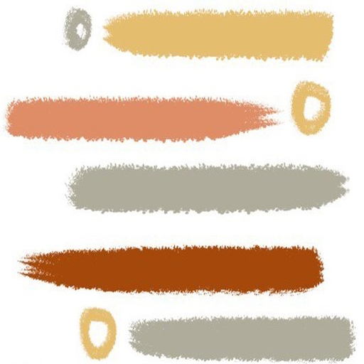

# News Whizz

It's and android app built with kotlin. Our app is a user-friendly news application that delivers the latest headlines and most talked-about news stories. It provides a convenient and personalized news browsing experience, keeping users informed and engaged. Stay updated with breaking news and explore a wide range of topics with our intuitive and easy-to-use interface.


## API Reference

#### Get all items

```http
  GET https://newsapi.org/v2/top-headlines?country=us&category=business&apiKey=684cb893caf7425abeffad82ac1d0f4e
```


## Features

- Online Registration
- Latest news headlines
- User Friendly
- Notified time to time 
- Light and quick


## Screenshots
| Log-in Screen | Sign-up Screen | Forgot-Password Screen |
| --- | --- | --- |
|  |  |  |
| Home-Screen | News full view screen | Expand-view screen |
|  |  |  |
| About-dialog screen | Notification | |
|  |  | |


## News-Whiz App Demo Video
[](https://drive.google.com/file/d/1C-wuCdiFnyUyi5S1l9NxOsJu05KQ9I9e/view?usp=sharing)


## Download
<a href="https://drive.google.com/file/d/1U4-5RmE0adpKsE2Zzr_8J9qtUjbSV8Gq/view">
  
</a>

[](https://drive.google.com/file/d/1U4-5RmE0adpKsE2Zzr_8J9qtUjbSV8Gq/view)


## Guide
[](https://drive.google.com/file/d/1GElnbmjbScRVkFy4aegT1asHwaAdVAYE/view?usp=sharing)

## Assignments
[](https://drive.google.com/drive/folders/1k6RlhUbbecNe8GtG5Q2kZH0nMO2FEZR1?usp=sharing)
